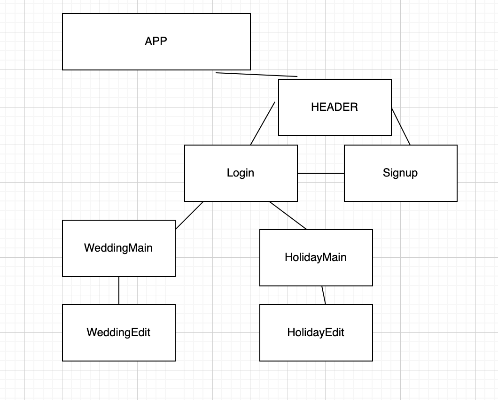

#Bookmark APP

# The Registry

The Registry is a Javascript application for saving your favorite links on the Internet!

## Installation

No installation is required, please see usage for the link to The Registry app.

## Usage

<a href="https://the-registry.netlify.app/">Click here to use The Registry</a>

## Component Tree

React Router Table 

## Technologies used

- Javascript

- HTML

- CSS

- React

- Bootstrap

- mdb-react-ui-kit

## Backend Repository

[The Registry Backend Repository link](https://github.com/katiepestotnik/the-registry-backend)

Created with care by Gianelle, Katie, Lydia